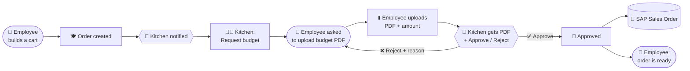
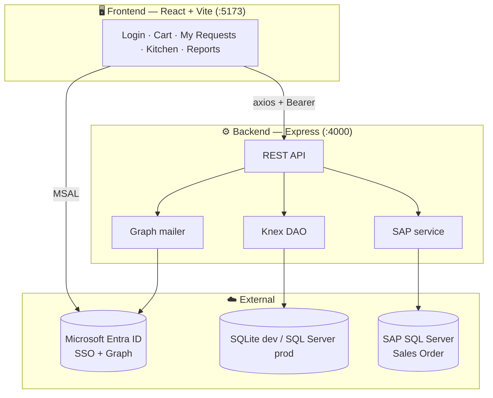

<!-- ============================ HEADER ============================ -->
<p align="center">
  
</p>

<p align="center">
  
</p>

<!-- ============================ BADGES ============================ -->
<p align="center">
  
  
  
  
  
  
  
</p>

<p align="center">
  <b>A fancy, animated, bilingual meal-ordering platform for the Egyptian Food Bank.</b><br/>
  Employees order from a chef-crafted menu (or send a special request); the kitchen handles budgets,
  approvals and delivery — with branded automated emails and a SAP Sales-Order sync.
</p>

---

## ✨ Highlights

| | |
|---|---|
| 🛒 **Cart ordering** | Add multiple meals with per-item quantities, plus free-text special-request lines |
| 🔐 **Mandatory Microsoft SSO** | Identity (name, email, department, phone) auto-read from Active Directory via Graph |
| 💸 **Budget workflow** | Kitchen requests a budget → employee uploads the PDF → kitchen **approves / rejects (with reason)** — from the app **or straight from the email** |
| 📧 **Branded automated emails** | Sent from `efb.apps@efb.eg` via Microsoft Graph, bilingual, with item tables & PDF attachments |
| 🧾 **My Requests** | Live status timeline, reorder in one tap, kitchen notes & rejection reasons |
| 📊 **Reports** | Searchable/filterable table, total budget, attachment download, CSV export |
| 🔗 **SAP sync** | Each approved order is pushed to a SQL Server Sales-Order table (with retry) |
| 🎨 **Premium UI** | Aurora background, cinematic login, parallax hero, smooth-scroll, EFB brand palette |
| 🌍 **Arabic + English** | Full RTL/LTR with one-tap switch |

---

## 🖼️ Screens

> Drop your captures into `docs/` and they'll render here.

| Login | Order (cart) | Kitchen | Reports |
|:--:|:--:|:--:|:--:|
|  |  |  |  |

---

## 🔄 The order → budget → SAP flow



Approve / Reject works **inside the app** and **from the email** (signed, 72-hour action links).

---

## 🏗️ Architecture



---

## 🚀 Getting started

> Runs on a **different port** from the Fleet app (which uses `3000`).

**1) Backend — port `4000`**
```powershell
cd backend
npm install
npm run dev
```

**2) Frontend — port `5173`**
```powershell
cd frontend
npm install
npm run dev
```

Open **http://localhost:5173** 🎉

- No Azure configured? The app falls back to a **demo sign-in** (just enter an email).
- With Azure configured, it switches to real **Microsoft sign-in** automatically.

---

## ⚙️ Configuration (`backend/.env`)

| Key | What it does |
|---|---|
| `PORT` | Backend port (default `4000`) |
| `DB_TYPE` | `sqlite` (dev) or `mssql` (prod) |
| `MSSQL_HOST` / `MSSQL_USER` / `MSSQL_PASSWORD` / `MSSQL_DATABASE` | SQL Server connection (when `DB_TYPE=mssql`) |
| `AZURE_CLIENT_ID` / `AZURE_TENANT_ID` | Microsoft SSO (login) |
| `AZURE_CLIENT_SECRET` | Enables Graph email + AD profile read |
| `MAIL_FROM` | Shared mailbox that sends mail (`efb.apps@efb.eg`) |
| `KITCHEN_EMAIL` | Mailbox that receives new orders |
| `MAIL_REDIRECT` | **Test mode** — reroute every email to one tester |
| `SAP_MSSQL_*` / `SAP_SALESORDER_TABLE` | SAP Sales-Order target |

---

## 🔐 Microsoft setup (one-time, by an admin)

1. **App registration** → SPA redirect URI `http://localhost:5173`.
2. **API permissions → Microsoft Graph → Application**: `Mail.Send`, `User.Read.All` → **Grant admin consent** (+ delegated `User.Read` for login).
3. **Certificates & secrets** → new client secret → put the **Value** in `AZURE_CLIENT_SECRET`.

Diagnostics:
```powershell
cd backend
node scripts/check-db.js     # verify SQL Server + create the DB
node scripts/test-graph.js   # verify token, profile read & mail send
```

---

## 🧱 Tech stack

- **Frontend:** React 18, Vite 5, Framer Motion, Lenis (smooth scroll), i18next, MSAL Browser
- **Backend:** Node.js, Express, Knex (SQLite / SQL Server), Multer, Nodemailer, Microsoft Graph
- **Auth:** Microsoft Entra ID (MSAL + JWT validation via JWKS)
- **Email:** Microsoft Graph `sendMail` (with attachments), branded bilingual templates

---

## 📁 Project structure

```
EFB-Meals/
├── backend/
│   ├── src/
│   │   ├── index.js            # app entry, route mounting, DB init
│   │   ├── db/                 # knex.js · migrate.js · seed.js · index.js (DAO)
│   │   ├── routes/             # auth · requests · budget · kitchen · sap
│   │   ├── budgetService.js    # request/approve/reject/note (app + email)
│   │   ├── sapService.js       # build & push Sales Orders (+ retry)
│   │   ├── graph.js            # Graph token, sendMail, getUser
│   │   ├── email.js            # Graph → SMTP → simulate (+ test redirect)
│   │   ├── actionToken.js      # signed approve/reject email links
│   │   └── templates/          # branded bilingual email templates
│   └── sql/sap_salesorder.sql  # SAP landing table DDL
└── frontend/
    └── src/
        ├── App.jsx
        ├── components/         # LoginGate · Aurora · Marquee · MenuCard · Kitchen · Reports · MyRequests
        ├── RequestForm.jsx     # the cart
        ├── auth.js · api.js · i18n.js · styles.css
```

---

## 🗺️ Roadmap

- [x] Cart with quantities + special lines
- [x] Budget upload → approve/reject (app + email)
- [x] Branded bilingual Graph emails
- [x] SAP Sales-Order sync
- [ ] Cost centers with monthly budgets + consumption reports
- [ ] Post-delivery rating (stars + comment, 12h after delivery)
- [ ] Recurring / scheduled orders

---

<p align="center">
  
</p>
<p align="center"><sub>Built for the Egyptian Food Bank 🧡 · EFB Meals</sub></p>
